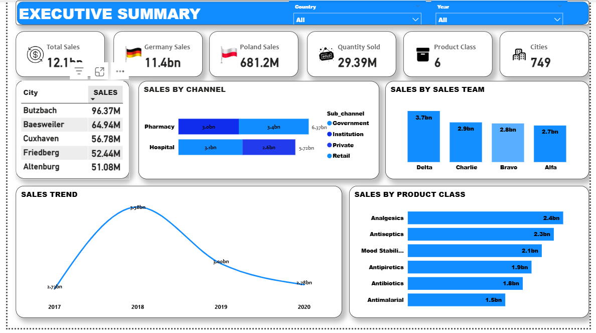

# 💊 Pharmaceutical Sales Analytics Dashboard

## 📌 Project Overview
This project presents an interactive Power BI dashboard developed to analyze pharmaceutical sales performance across key business dimensions, including revenue trends, product performance, and sales team efficiency.

The dashboard was built as an early business intelligence project, focusing on transforming raw pharmaceutical sales data into structured insights that can support business understanding and decision-making.

## 🎯 Business Objective
The objective of this dashboard is to provide stakeholders with a consolidated view of pharmaceutical sales performance by:
- Monitoring overall revenue trends
- Evaluating sales team performance
- Identifying high-performing product classes
- Deriving insights and recommendations from sales data

## ❓ Business Questions Explored
- How has pharmaceutical revenue evolved over time?
- Which product classes contribute most to total sales?
- How do individual sales teams perform relative to one another?
- What strategic insights can be derived from observed sales patterns?

## 🧠 Tools Used
- **Power BI Desktop** – Data transformation, data modeling, DAX calculations, and dashboard visualization

## 📂 Dataset Description
The dataset used for this project (`Pharm Data.xlsx`) contains pharmaceutical sales records, including:
- Sales values and quantities
- Product class information
- Sales team identifiers
- Time-based sales records
- Other relevant attributes used for analysis

## 🛠 Methodology
- Imported and cleaned the dataset directly in Power BI
- Created calculated measures to track key sales metrics
- Designed interactive visuals with slicers to enable exploratory analysis
- Structured the dashboard to present both high-level summaries and performance-focused views

## 📊 Dashboard Pages
### 1. 📈 Executive Summary
Provides a high-level overview of total revenue, sales trends, and key performance indicators.

### 2. 👥 Sales Team Performance
Analyzes sales performance across teams, enabling comparison and identification of top-performing teams.

### 3. 💡 Recommendations
Summarizes insights derived from the analysis and presents data-driven recommendations to support strategic decision-making.

## 🖼 Dashboard Preview

### Executive Summary

### Sales Team Performance

## 📈 Key Insights
- Revenue experienced a significant increase in 2018 following the company’s expansion into the Polish market.
- Sales performance varies across teams, with certain teams consistently outperforming others.
- Analgesics and antiseptics emerged as the highest-performing product classes, contributing a substantial share of total revenue.

## 💡 Key Recommendations
- Although data on costs and profit margins is unavailable, the noticeable increase in revenue following market entry into Poland suggests potential benefits from exploring additional markets, subject to thorough market analysis.
- An evaluation of the factors contributing to the efficiency of Charlie’s sales team is recommended. Successful strategies identified can be replicated across other teams to improve overall resource utilization.
- Performance gaps within other sales teams should be addressed through targeted improvements to support sustainable revenue growth and organizational effectiveness.
- Further examination of the drivers behind the strong performance of analgesics and antiseptics is recommended, as insights gained could be applied to improve the performance of other product classes.

## 💼 Business Value
This dashboard enables stakeholders to:
- Monitor pharmaceutical sales performance at a glance
- Assess sales team efficiency
- Identify key revenue-driving products
- Support strategic discussions using data-backed insights

## 📝 Project Note
This dashboard reflects my early work in Power BI, focused on exploratory analysis and foundational dashboard design. Since completing this project, I have strengthened my skills in analytical storytelling, KPI definition, and dashboard structuring, and plan to enhance this analysis in future iterations.

## 📁 Files Included
- Pharmaceutical sales dataset (`Pharm Data.xlsx`)
- Power BI dashboard file (`Pharm.pbix`)
- Dashboard screenshots

## 📬 Contact
**Malik Azeez**  
LinkedIn: https://www.linkedin.com/in/malik-azeez  
GitHub: https://github.com/Malikazeez

